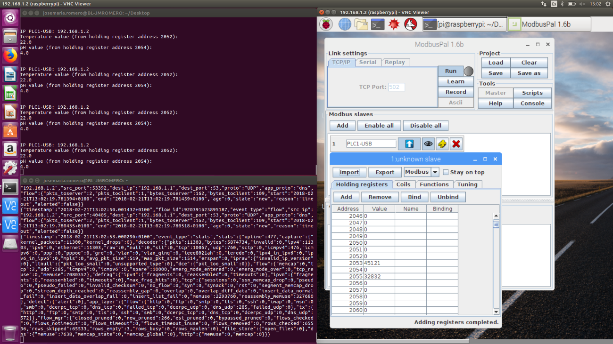

# ethicalhacking-modbus

## What is ethical hacking and what is it used for?

Ethical hacking involves a hacker agreeing with an organisation or individual who authorizes the hacker to levy cyber attacks on a system or network to expose potential vulnerabilities. An ethical hacker is also sometimes referred to as a white hat hacker. Many depend on ethical hackers to identify weaknesses in their networks, endpoints, devices, or applications. The hacker informs their client as to when they will be attacking the system, as well as the scope of the attack.

## Modbus ethical hacking

We should find out threats and vulnerabilities in those systems (and mitigate them).

For this hacking demonstration, I built a proof of concept (PoC) as a digital platform for the industrial water sector to check that the concept of ethical hacking (through open source intrusion detection systems (IDS)) can be operated usefully.

The hardware part of the proof of concept comprises three parts, PLC-Raspberry Pi (PLC1-USB), PLC-Raspberry Pi (PLC2-GSM) and PLC-Arduino-BLE Shield (PLC3-BLE). Open source intrusion detection systems (IDS) are implemented on this with the Snort, Suricata and Bro software and on a Modbus fieldbus to connect the PLC-Raspberry Pi systems.

